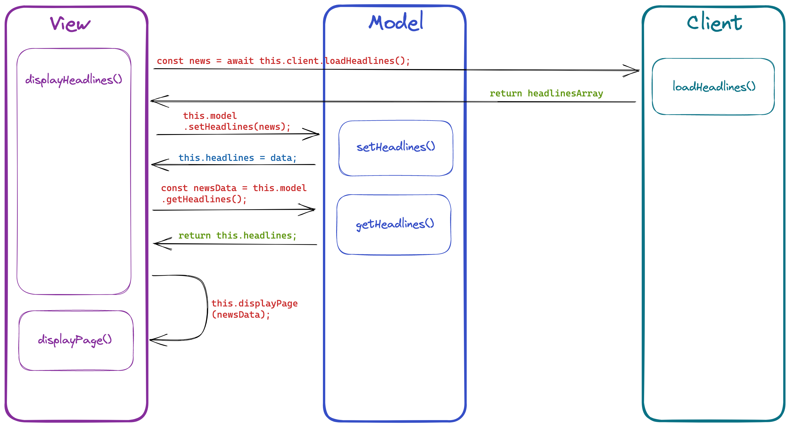

# News challenge

[Top](#news-challenge) | [Brief](#the-brief) | [Getting started](#getting-started) | [Use](#notes-on-use) | [Tests](#running-tests) | [Tech](#technologies-used) | [User stories](#user-stories) | [Screenshots](#screenshots) | [API](#api) | [Resources](#resources) | [Mockups](#mockups)

<p align="left">
    
    
    
    
    
    
    
    
 </p>

News Challenge is a Makers Academy weekend challenge to build a news app using the Guardian API.

The app displays the top 10 headlines from the Guardian API. Clicking on a headline will open the article in a new tab. The search bar will filter the headlines by keyword.

The app title is 'The Grauniad' - a reference to the nickname given to the Guardian newspaper due to its frequent typos as made famous by Private Eye.

## The Brief

Your app will grab all the headlines from the Guardian newspaper API and display them on a
page. Clicking on a headline will link the user to the actual article page on the Guardian's website.
You'll write a single page web app. You'll write your code in frontend JavaScript, CSS and
HTML. You won't use Ruby or backend JavaScript.

## Getting Started

1. Clone this repo `git clone
2. Install dependencies `npm install`
3. Build the app `npm run build`
4. `open index.html` to open the app in your browser

## Notes on Use

1. The app will display the top 10 headlines from the Guardian API
2. Clicking on a headline will open the article in a new tab
3. The search bar will filter the headlines by keyword

## Running Tests

Enter `jest` in the command line to run the tests.

## Technologies Used

[Top](#news-challenge) | [Brief](#the-brief) | [Getting started](#getting-started) | [Use](#notes-on-use) | [Tests](#running-tests) | [Tech](#technologies-used) | [User stories](#user-stories) | [Screenshots](#screenshots) | [API](#api) | [Resources](#resources) | [Mockups](#mockups)

- JavaScript
- Node.js
- NPM
- HTML
- CSS
- Jest
- Postman
- Git
- GitHub
- esbuild

## User Stories

```
As a busy politician
So I know what the big stories of the day are
I can see all of today's [headlines] in [one_place]
=> page with headlines
```

```
As a busy politician
So that I have something nice to look at
I can see a relevant [picture] to illustrate [each_news_article] when I browse [headlines]
=> image to go with each headline
```

```
As a busy politician
So I can get a few more details about an important story
I can click a news article [title] which [links] to the [original_article]
=> Headlines link to main article
```

```
As a busy politician
So I can search what I want to read about
I can specify a [search_query] on the page and get [articles_matching] this search
=> search functionality
```

## Processes

As part of my planning for this project, I mapped out the processes over time. This helped me to plan my classes and methods.



## Screenshots

[Top](#news-challenge) | [Brief](#the-brief) | [Getting started](#getting-started) | [Use](#notes-on-use) | [Tests](#running-tests) | [Tech](#technologies-used) | [User stories](#user-stories) | [Screenshots](#screenshots) | [API](#api) | [Resources](#resources) | [Mockups](#mockups)

The main screen showing the top 10 headlines from the Guardian API:


The search bar will filter the headlines by keyword. In this example, the search term is 'ai':


## API

### API authentication

[Top](#news-challenge) | [Brief](#the-brief) | [Getting started](#getting-started) | [Use](#notes-on-use) | [Tests](#running-tests) | [Tech](#technologies-used) | [User stories](#user-stories) | [Screenshots](#screenshots) | [API](#api) | [Resources](#resources) | [Mockups](#mockups)

This project required [an API
key](https://open-platform.theguardian.com/access/) to use the Guardian API. 
The API key is imported from a gitignored file and is passed to the API as a query parameter.

### API request rate limits and stubbing

The Guardian API is severely rate-limited.

**tests were stubbed so that the daily API limit was not exceeded. Otherwise, all requests would be rejected and everyone's apps would stop working!**

## Guardian API Overview

```
curl "https://content.guardianapis.com/search?q=America&query-fields=headline&show-fields=thumbnail,headline,byline&order-by=newest&api-key=test"
```

The above request will return a response similar to this one:
```json
{
   "response":{
      "status":"ok",
      "userTier":"developer",
      "total":2324223,
      "startIndex":1,
      "pageSize":10,
      "currentPage":1,
      "pages":232423,
      "orderBy":"newest",
      "results":[
         {
            "id":"sport/blog/2022/feb/02/at-last-the-inventors-of-modern-skiing-have-something-to-cheer-dave-ryding",
            "type":"article",
            "sectionId":"sport",
            "sectionName":"Sport",
            "webPublicationDate":"2022-02-02T14:42:43Z",
            "webTitle":"At last, the inventors of modern skiing have something to cheer: Dave Ryding | Andy Bull",
            "webUrl":"https://www.theguardian.com/sport/blog/2022/feb/02/at-last-the-inventors-of-modern-skiing-have-something-to-cheer-dave-ryding",
            "apiUrl":"https://content.guardianapis.com/sport/blog/2022/feb/02/at-last-the-inventors-of-modern-skiing-have-something-to-cheer-dave-ryding",
            "fields":{
               "headline":"At last, the inventors of modern skiing have something to cheer: Dave Ryding ",
               "byline":"Andy Bull",
               "thumbnail":"https://media.guim.co.uk/1e2ab1ced5da6ecf8d7fcca9f87d5398c1d22336/0_119_6480_3888/500.jpg"
            },
            "isHosted":false,
            "pillarId":"pillar/sport",
            "pillarName":"Sport"
         },
         {
            "id":"business/live/2022/feb/02/oil-prices-climb-seven-year-highs-opec-meeting-markets-await-eurozone-inflation",
            "type":"liveblog",
            "sectionId":"business",
            "sectionName":"Business",
            "webPublicationDate":"2022-02-02T14:41:49Z",
            "webTitle":"Ofgem to unveil new household energy bill price cap on Thursday morning – business live",
            "webUrl":"https://www.theguardian.com/business/live/2022/feb/02/oil-prices-climb-seven-year-highs-opec-meeting-markets-await-eurozone-inflation",
            "apiUrl":"https://content.guardianapis.com/business/live/2022/feb/02/oil-prices-climb-seven-year-highs-opec-meeting-markets-await-eurozone-inflation",
            "fields":{
               "headline":"Ofgem to unveil new household energy bill price cap on Thursday morning – business live",
               "byline":"Julia Kollewe",
               "thumbnail":"https://media.guim.co.uk/aee3b3b05ea2a37acdadc91095c163fd381eba4a/0_24_3500_2100/500.jpg"
            },
            "isHosted":false,
            "pillarId":"pillar/news",
            "pillarName":"News"
         },
         // ...
      ]
   }
}
```

## Resources

[Top](#news-challenge) | [Brief](#the-brief) | [Getting started](#getting-started) | [Use](#notes-on-use) | [Tests](#running-tests) | [Tech](#technologies-used) | [User stories](#user-stories) | [Screenshots](#screenshots) | [API](#api) | [Resources](#resources) | [Mockups](#mockups)

* [Guardian newspaper API homepage](http://open-platform.theguardian.com/documentation/)
* cURL [man page](https://curl.haxx.se/docs/manpage.html)
* [Postman](https://www.postman.com/downloads/?utm_source=postman-home), a program to send and test HTTP requests

## Mockups
### Headlines page


### Article summary page


[Top](#news-challenge) | [Brief](#the-brief) | [Getting started](#getting-started) | [Use](#notes-on-use) | [Tests](#running-tests) | [Tech](#technologies-used) | [User stories](#user-stories) | [Screenshots](#screenshots) | [API](#api) | [Resources](#resources) | [Mockups](#mockups)